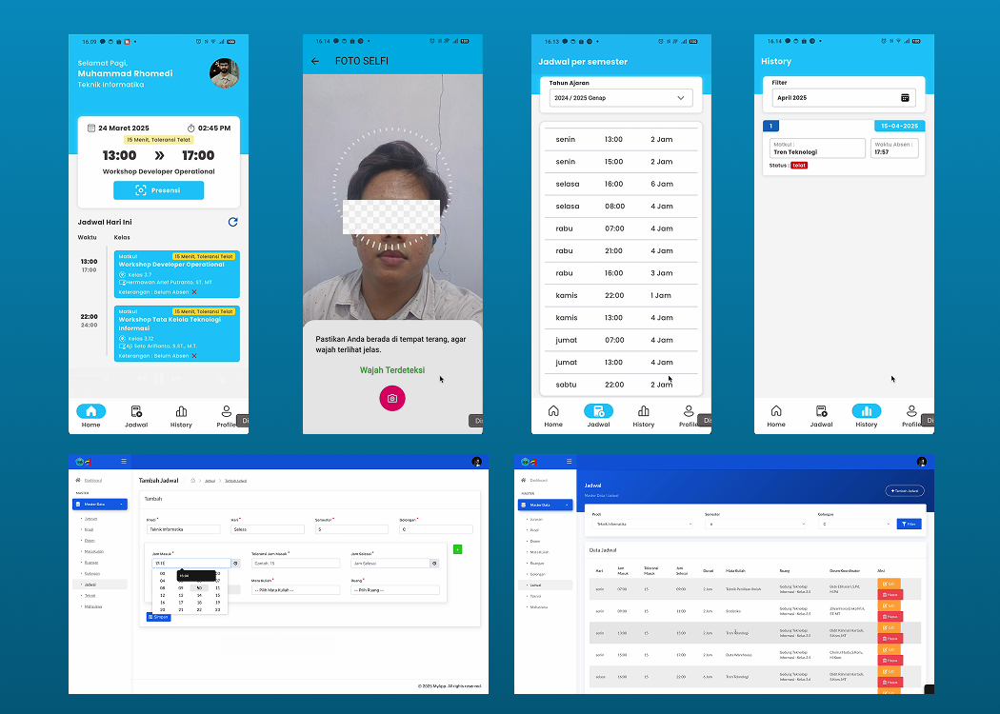

<div align="center">
  
  
  <h1>🎓 Polije Smart Attendance - Face Recognition</h1>
  <p>An advanced university attendance system integrating Real-Time Face Detection and Machine Learning (2D-LDA & KNN).</p>

  <p>
    
    
    
  </p>
</div>

## 📖 About The Project

This application was developed as a comprehensive thesis project for **Politeknik Negeri Jember (Polije)**. It modernizes the student attendance process by replacing manual input with biometric face recognition.

The system utilizes an edge-to-cloud Machine Learning architecture. The Flutter mobile app handles real-time face detection and image pre-processing. The captured data is then securely transmitted to a **Laravel Backend**, where classification algorithms (**2D-LDA and KNN**) accurately identify the student's face.

## ✨ Key Features

* 🧑‍💻 **Real-Time Face Detection:** Utilizes Google ML Kit to detect human faces locally on the device camera before capturing, ensuring only valid photos are sent to the server.
* 🧠 **Advanced ML Integration:** Connects seamlessly with a backend running **Two-Dimensional Linear Discriminant Analysis (2D-LDA)** and **K-Nearest Neighbors (KNN)** for high-accuracy biometric recognition.
* 🏗️ **Robust State Management:** Architected using the **BLoC (Business Logic Component)** pattern for predictable state transitions, clean code separation, and high scalability.
* 🔒 **Secure Environment Variables:** Uses `flutter_dotenv` to keep API keys and base URLs strictly confidential.
* 🎨 **Smooth UI & Animations:** Integrates `lottie` animations and `shimmer` loading effects for a highly interactive and premium user experience.

## 🛠️ Tech Stack & Architecture

* **Framework:** Flutter (`>=3.6.0`)
* **State Management:** [`flutter_bloc`](https://pub.dev/packages/flutter_bloc)
* **Machine Learning (Edge):** [`google_mlkit_face_detection`](https://pub.dev/packages/google_mlkit_face_detection)
* **Image Processing:** [`image`](https://pub.dev/packages/image) (For compressing and formatting facial data before API transmission)
* **Network & API:** [`http`](https://pub.dev/packages/http) with [`flutter_dotenv`](https://pub.dev/packages/flutter_dotenv) for environment configurations.
* **UI/UX Components:** [`lottie`](https://pub.dev/packages/lottie), [`shimmer`](https://pub.dev/packages/shimmer), [`google_fonts`](https://pub.dev/packages/google_fonts)
* **Backend Integration:** Designed to communicate with a custom Laravel backend handling the core 2D-LDA & KNN logic.

## 📱 Screenshots

<div align="center">
  
  
  
  
</div>

## 🚀 Getting Started

### Prerequisites
* Flutter SDK `^3.6.0`
* Active Laravel/Python API endpoint for Face Recognition (2D-LDA & KNN)

### Installation

1. Clone the repo:
   ```sh
   git clone [https://github.com/Rhomaedy1201/attendance-online-polije-face-recognation.git](https://github.com/Rhomaedy1201/attendance-online-polije-face-recognation.git)
